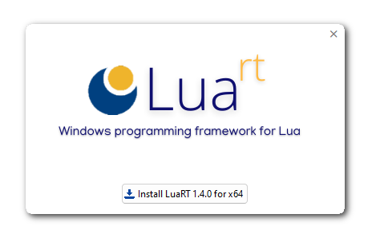

There are two ways to install the official Luart distribution on Windows:

* **Luart installer**  
This approach involves downloading Luart directly from the official website [https://www.luart.org](https://luart.org). This is the simplest and recommended installation method.

* **Manual installation**  
This method offers more customization for advanced users. It involves downloading Luart sources and manual compilation. This is a complex installation method and should not be recommended for newcomers.

# Installation with Luart installer

This method is rather simple, thanks to its specific Windows installer (built with Luart !).
##  
## Download the installer
Follow these steps to download the full installer:

* Open a browser window and navigate to the official website [https://www.luart.org](https://luart.org) page and click on the "Download Luart" button.
* This will take you to the latest GitHub Release page.
* Scroll to the bottom and select either Windows x86 or x64 installer (depending on your Windows platform)
  
!!! question "Help on choosing installation version"
    The Luart installer comes in either 32-bit or 64-bit versions :  
    - On a 32-bit processor, you should choose the x86 installer. The installation will fail if you try to install the x64 version on a 32-bit processor.   
    - On a 64-bit processor, it is possible to use both installers, but it is highly recommended using the x64 one, as applications will run faster on a 64-bit system.  
  
    If you're not sure which one to choose, the 64-bit version is the best choice.
    
    Don't try to install both version on the same computer.
##  
## Run the installer
Once you have chosen and downloaded the right installer, open the downloaded ZIP file and double-click on the installer executable to show this window :

<figure markdown>
  
</figure>

The installation process is simple :

* Click on the installation button to proceed
* You will be prompted to choose the installation directory
* Wait until the installation process is done
  
!!! warning "Windows operating system prevents the application from starting"        
    Luart may be blocked by Microsoft Defender SmartScreen because executable is not EV certified (executables are not signed).   
      
    ➡️If the blue window opens when running setup file, click on "More info" and then "Run anyway"  

!!! warning "Windows Defender places the installer in quarantine"
    During virus scanning, Microsoft Defender may show a false positive result for LuaRT, since the setup executable is not signed with an EV certificate.  
      
    ➡️Open Windows Defender  
    ➡️Click on "Virus & Threat Protection", select "All recent items", then select "Allow from the actions" drop-down menu.  
#  
# Manual installation

This method is complex. Don't try to use it if you are not familiar with C/C++ compilation.
##  
## Download the Luart source code
You can download the source code using the one of the following methods :

* Go to the latest [GitHub Release page](https://github.com/samyeyo/LuaRT/releases/latest), scroll to the bottom and download the source code archive. Unpack it anywhere on your hard drive.
  
* Go to the [GitHub repository](https://github.com/samyeyo/LuaRT/) and click on the green button "Code" then click on "Download ZIP" to download the latest source code archive. Unpack it anywhere on your hard drive.

* Open a `git` prompt or your preferred git-capable IDE and clone/fork the GitHub repository
##  
## Compile Luart
Once downloaded, be sure to have a working C/C++ compiler (only Microsoft Visual C/C++ and Mingw-w64 8.1.0 are supported).
To compile Lua^rt^, follow this steps :

* Open a console prompt and be sure that your compiler can be executed from the command line

* Go to the folder that contains Luart source code

* Start the build process by entering `make` (for Mingw-w64 compiler) or `nmake` (for Microsoft Visual C/C++ compiler)

If everything went right :

* The Luart toolchain (interpreters, rtc compiler and  the `lua54.dll` runtime) are generated in the `/bin` folder

* The Luart library is generated in the `/lib` folder (either `liblua54.a` on Mingw-w64 or `lua54.lib` for Microsoft Visual C/C++)

* Luart additional modules will be generated in the `/modules` folder
##  
## Additional setup
Once compiled, you should update your `PATH` environment variable with the location of the Luart `\bin` folder.
You should set file associations with `.lua` and `.wlua` extensions too, to be able to run Luart from the Windows explorer. 